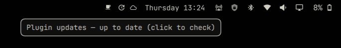

# oma.plugin-updates

A verified-only update notifier for Omarchy plugins — with a one-click bar widget and desktop notifications that never silently install anything.



*Bar widget (`󰚰`) in the top bar — hover shows `Plugin updates – up to date (click to check)`, click triggers a manual check. When updates are pending a red dot appears and the tooltip lists `1.4.0 → 1.5.0 — click to review`.*

## Features

- **Verified-only** — only `verificationStatus === "verified"` entries from the marketplace generate notifications; unverified releases are ignored
- **Bar widget** (`󰚰` at `Style.bar.iconFont` 13) — always visible for manual checks, red dot + urgent tint when verified updates are pending, `󰑐` reverse-arrow spin while checking, tooltip `Plugin updates — up to date (click to check)` or `2 plugin updates available — click to review`
- **Desktop notifications** — `Verified plugin update available` titles per plugin with the exact command to run:
  ```text
  macOS Dock (macos.dock) has an update
  Run: omarchy plugin update macos.dock  (0.1.10 → 0.1.11)
  ```
  and `No Updates Are Available.` / `All verified plugins are up to date.` on manual checks with nothing pending
- **Never auto-installs** — click `Review Update` launches `omarchy-launch-floating-terminal-with-presentation omarchy plugin update <id>` without `--yes`; Omarchy shows the diff and asks for confirmation, then validates and rolls back on failure
- **Strict SemVer** — fixed `^v?(?:0|[1-9]\d*)\.` regex (grouped alternation), `1.9.0 < 1.10.0`, numeric prerelease ordering (`1.0.0-alpha.2 < 1.0.0-alpha.10 < 1.0.0`), build metadata ignored
- **Sleep/lid-aware polling** — `60s` startup delay, `12h` periodic, plus a `60s` wall-clock poll against persisted `lastCheckMs` that catches up within a minute of resume; `5m → 15m → 30m → 60m` backoff on catalog fetch failures, silent until success
- **Deduped notifications** — `PersistentProperties` `notifiedVersions` map (`{ "macos.dock": "1.5.0" }`) with replace-object `Object.assign({},…)` so the same verified version is notified once

## Install

Add and enable through Omarchy's plugin manager (requires Omarchy + Quickshell):

```bash
omarchy plugin add https://github.com/ifubaraboye/omarchy-plugin-updates.git
omarchy plugin enable oma.plugin-updates --section right
omarchy-shell shell rescanPlugins
# or
omarchy restart shell
```

The bar widget lands in the right section (between tray and indicators by default). Move it:

```bash
omarchy bar move oma.plugin-updates --section right --index 1
omarchy bar move oma.plugin-updates --section left
```

The plugin stores no extra files besides its own `PersistentProperties` (`oma-plugin-updates` `notifiedVersions` + `lastCheckMs`). No `~/.config/omarchy/` files are overwritten.

## Requirements

- Omarchy with `quickshell` and `omarchy-shell` (`omarchy-shell shell listPlugins`, `omarchy plugin list --json`, `omarchy notification send`)
- `bash`, `curl`, `python3`, `jq` (for manifest reads), `notify-send` via Omarchy's notification daemon
- Marketplace catalog at `https://raw.githubusercontent.com/HANCORE-linux/omarchy-plugin-marketplace/main/site/catalog.json` (single `catalogUrl` constant in `service/Service.qml:20`, trivial switch to `https://omarchyplugins.com/catalog.json`)

## Bar widget

Always visible — waybar-style manual trigger:

- **Idle** `󰚰` — hover `Plugin updates — up to date (click to check)`, click → `omarchy-shell oma.plugin-updates check "{}"` → `checking` spin
- **Checking** `󰑐` spinning `⟲` reverse arrow centered in `statusSlot`, `opacity 0.7`, tooltip `Checking…` suppressed (short stable tooltip avoids flicker)
- **Pending** `󰚰` urgent tint + 6px red dot top-right, tooltip `macOS Dock 0.1.10 → 0.1.11 — click to review` or `3 plugin updates available — click to review`, click → `bar.run("omarchy-launch-floating-terminal-with-presentation omarchy plugin update <id>")` for first pending

The widget is a `BarWidget` (`service/PluginUpdatesWidget.qml:12`) viewing the single `service` instance via `bar.shell.serviceFor("oma.plugin-updates")` (`oma.nearby` pattern), so all monitors share one catalog fetch. Its IPC target `oma.plugin-updates-widget` also exposes `refresh()`.

## Notifications

- **Update available** (`Service.qml:96` `notifyUpdate`):
  ```text
  Title: macOS Dock (macos.dock) has an update
  Body:  Run: omarchy plugin update macos.dock  (0.1.10 → 0.1.11)
  Glyph: 󰚰  Urgency: normal  Exec: omarchy-launch-floating-terminal-with-presentation omarchy plugin update macos.dock
  ```
  Clicking runs the updater, which fetches, diffs (via `delta` if present), confirms `Update <id>?`, fast-forwards only, validates with `omarchy-plugin-validate`, and rolls back to `ORIG_HEAD` on failure (`/usr/share/omarchy/bin/omarchy-plugin-update:43`).

- **Up to date** (manual check only, `Service.qml:120` `notifyUpToDate`):
  ```text
  Title: No Updates Are Available.
  Body:  All verified plugins are up to date.
  Glyph: 󰄬  Urgency: low
  ```
  Background 12h checks stay silent; only manual `check` via the bar widget triggers this.

Placeholder pins or invalid SemVer (`latest`, `01.0.0`) are skipped and logged.

## How it works

```text
Marketplace (site/catalog.json: plugins[].verificationStatus)
  ↓  curl --max-time 10  catalogUrl
Service.qml: listPlugins (omarchy-shell shell listPlugins || omarchy plugin list --json) → authoritative ids
  ↓  python3 -c  → ~/.config/omarchy/plugins/<id>/manifest.json  version (fallback, not enumeration)
UpdateChecker.js: normalizeCatalog() → {id, version, commit, repo, name}  →  findUpdates(ids, catalog)
  ↓  semver compare (installed < verified → pending)
  ↓  pendingUpdates exposed to bar widget + filtered by notifiedVersions → toNotify
  ↓  PersistentProperties notifiedVersions + lastCheckMs (replace-object)
  ↓  omarchy notification send / bar dot
  ↓  user clicks Review Update → omarchy plugin update <id> (interactive)
```

Discovery is hybrid: `listPlugins` gives the canonical enabled set (first-party, symlinked, future storage changes), manifest reads are a version fallback. Filtering is explicit:

```text
not in marketplace → ignore
unverified → ignore
verified → semver compare
```

`normalizeCatalog` isolates marketplace field names (`verificationStatus`/`verificationCommit` vs legacy `status`/`validatedCommit`) into `status`/`commit`, so `findUpdates` never knows the upstream naming. `status === "Available"` (UI) is never confused with `verificationStatus === "verified"`.

Catalog inspection (694 plugins, ~358 verified, 2026-08-20) confirmed fields `id`, `version`, `verificationStatus`, `verificationCommit`, `verificationBaselineVersion`, `repo`, `name`; `verificationBaselineVersion` is marketplace schema, not SemVer.

## Timings

- **Startup:** `startupDelayMs 60s` after shell loads, then first check
- **Periodic:** `periodicMs 12h` after success (`schedulePeriodic` stores `lastCheckMs = Date.now()`)
- **Backoff:** `5m → 15m → 30m → 60m` (`backoffMs`) on catalog fetch failure, reset on success; no error toast, just `log`
- **Poll:** `pollMs 60s` `maybeCatchUpAfterResume()` — if `Date.now() - lastCheckMs ≥ 12h` and not `checking`/`backoffTimer.running`, run now (handles suspend/lid-close where QML `Timer` pauses)

## Trust & security

**DOES:**
- Use only `verificationStatus === "verified"`; unverified ignored even if newer
- Treat marketplace as recommendation, not cryptographic trust anchor (v2: `catalog.json.sig` + embedded public key)
- Notify once per `id@verifiedVersion` via `notifiedVersions`
- Defer install to Omarchy's updater, require human confirmation

**DOES NOT:**
- `git pull` / `checkout` / modify plugins
- Use `--yes` or `origin HEAD` as authority
- Trust GitHub `main` or HTTPS as signing
- Notify about unverified or downgrade (`installed > verified` → no notification)

Plugin-directory listing is not a security review — review source before installing.

## Removal

```bash
omarchy plugin disable oma.plugin-updates
# also removes bar widget from layout
rm -rf ~/.config/omarchy/plugins/oma.plugin-updates
# optional: clear persisted state (Quickshell PersistentProperties)
rm -f ~/.config/quickshell/oma-plugin-updates.conf  # location varies by Quickshell version
omarchy restart shell
```

The plugin creates no other files under `~/.config/omarchy/`.

## Development

```bash
./tests/run.sh          # node --test tests/UpdateCheckerTest.js — 30 tests
node --test tests/UpdateCheckerTest.js
omarchy plugin validate ./   # must pass (was omarchy.* reserved, now oma.plugin-updates)
qmllint service/Service.qml service/PluginUpdatesWidget.qml
```

Pure logic lives in `service/UpdateChecker.js` (`.pragma library`, Node-testable via `vm` stripping the pragma, like `OmaDock/DockModel.js`). Tests cover:

- `1.4.0 → 1.5.0` update, `1.5.0 → 1.5.0` none, `1.6.0 → 1.5.0` no downgrade, `1.9.0 → 1.10.0` numeric, `v` prefix, `+build` ignored, `01.0.0` invalid
- `1.0.0-alpha < 1.0.0-alpha.1 < 1.0.0-beta < 1.0.0`, numeric prerelease `alpha.2 < alpha.10`, `numeric < alphanumeric`
- `plugin missing → ignore`, `unverified → ignore`, `verified → compare`, `latest → ignore`, legacy `status`/`validatedCommit` fallback, `status === "Available"` not mistaken for verified
- `first discovery → notify`, `same version → no repeat` (replace-object), `plugin updated → clear`, `new verified → notify again`
- `success → 12h`, `failure → 5m/15m/30m/60m`, `success after failure → reset`

Manual bar check:

```bash
omarchy-shell oma.plugin-updates check "{}"
omarchy-shell oma.plugin-updates status "{}" | jq .
# trigger widget
omarchy-shell shell call oma.plugin-updates-widget refresh 2>/dev/null || true
```

Force a notification for testing (marketplace currently has `macos.dock 0.1.10` installed vs `0.1.9` verified → no update, so lower one file):

```bash
cp ~/.config/omarchy/plugins/macos.dock/manifest.json /tmp/macos.bak
jq '.version="0.1.0"' ~/.config/omarchy/plugins/macos.dock/manifest.json > /tmp/m.json && cp /tmp/m.json ~/.config/omarchy/plugins/macos.dock/manifest.json
omarchy-shell oma.plugin-updates check "{}"  # → notification + bar dot
# restore
cp /tmp/macos.bak ~/.config/omarchy/plugins/macos.dock/manifest.json; omarchy-shell shell rescanPlugins
```

The `service/` bar widget was added after initial `service`-only v1; `keepLoaded: true` keeps the service singleton, so `rescanPlugins` hot-reloads but `omarchy restart shell` is safest after manifest kind changes.

## Project structure

```text
oma.plugin-updates/
├── manifest.json                 # schemaVersion 1, id oma.plugin-updates, kinds ["service","bar-widget"]
├── LICENSE
├── README.md
├── preview.png                   # bar widget preview (copy of assets/bar-preview.png)
├── assets/bar-preview.png        # head image
├── service/
│   ├── Service.qml               # startup 60s, 12h, backoff, poll, PersistentProperties, curl, python manifest read, notifications
│   ├── PluginUpdatesWidget.qml   # BarWidget @ Style.bar.iconFont 13, 󰚰 idle / 󰑐 spin (reverse arrow, no clock hands), red dot, tooltip, click → check/review
│   └── UpdateChecker.js          # isValidSemver / parseSemver / compareSemver / normalizeCatalog / findUpdates / shouldNotify / nextBackoffInterval
└── tests/
    ├── UpdateCheckerTest.js
    └── run.sh
```

## Decisions

| Question | Decision |
|---|---|
| Plugin ID | `oma.plugin-updates` (`omarchy.plugin-updates` reserved by `omarchy-plugin-validate`) |
| Repo | `ifubaraboye/omarchy-plugin-updates` on `main` |
| Notification | Single `Review Update` exec, `No Updates Are Available.` on manual up-to-date |
| Bar widget | `Style.bar.iconFont` 13, `󰚰`, red dot, short stable tooltip, `−360°` reverse-arrow spin without rotating the button (avoids hover loss) |
| Discovery | IPC authoritative (`listPlugins`) + `~/.config/omarchy/plugins/<id>/manifest.json` via `python3 -c` fallback (no bash loop) |
| Fetch | `Process` + `curl --max-time 10` + `python3 -c` manifest read |
| `catalogUrl` | Fixed `https://raw.githubusercontent.com/HANCORE-linux/omarchy-plugin-marketplace/main/site/catalog.json` |
| Signed catalog | v2 `catalog.json.sig` |

## Marketplace schema

Lock confirmed via live `site/catalog.json` (verified example `simple.dock 1.0.0` / `rosakodu.dock 1.3.0`):

```json
{
  "id": "rosakodu.dock",
  "version": "1.3.0",
  "verificationStatus": "verified",
  "verificationCommit": "58ced286…",
  "verificationBaselineVersion": "3",
  "repo": "https://github.com/rosakodu/omarchy-dock"
}
```

`version` is SemVer, `verificationStatus` is `verified`/`unverified`, `status` (`Available`/`Manual setup`) is UI and not used for update gating.

## Acknowledgements

Inspired by `OmaDock` (`ifubaraboye/omarchy-dock`) for layout, icon overrides, and preview assets. Marketplace by `HANCORE-linux/omarchy-plugin-marketplace`.
